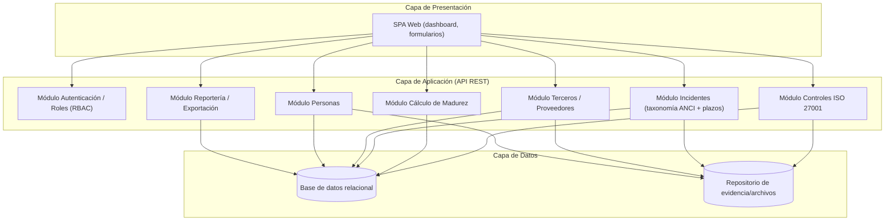

# FORMULACIÓN DEL PROYECTO DE TÍTULO

> Borrador de contenido para copiar/adaptar en `TIHI84_U1_Plantilla_informe_Guía_ABPro.docx`.
> Los bloques marcados con **[PENDIENTE]** requieren datos institucionales oficiales (organigrama,
> misión/visión, presupuesto real, etc.) que el equipo debe validar directamente con el mandante
> (Hospital Félix Bulnes Cerda) antes de la entrega, ya que no fueron proporcionados en la entrevista
> base y no deben inventarse ni copiarse de fuentes externas sin verificar.
>
> **Actualizado para ES1:** la guía de Evaluación Sumativa 1 (`TIHI84_U1_ES1_GUÍA.txt`) agrega a la
> ponderación las Actividades 7 y 8 (arquitectura TI y arquitectura empresarial, secciones VII y VIII)
> y evalúa con escala Excelente/Bueno/Insatisfactorio en lugar del Sí/No de la EF1. Por eso ambas
> secciones se desarrollaron aquí con mayor profundidad (plan de diseño concreto), y se cuidó el uso
> de lenguaje formal/técnico y la coherencia problema→solución→conclusión (criterio 1.1.6).

**Asignatura:** Proyecto de Título – TIHI84
**Sección:** [PENDIENTE: completar]
**Académico guía:** Luis Bravo
**Referente / encargado de seguridad (mandante):** Miguel Godoy — Hospital Félix Bulnes Cerda
**Integrantes del equipo:** Priscila Bahamóndez (Líder) + 2 integrantes [PENDIENTE: completar]

**Nombre tentativo del proyecto:** Sistema de Gestión de Seguridad de la Información (SGSI) para el
seguimiento de madurez de controles ISO/IEC 27001 e incidentes de ciberseguridad — Hospital Félix
Bulnes Cerda.

---

## I. Introducción

El Hospital Félix Bulnes Cerda, establecimiento público de alta complejidad perteneciente a la Red
Asistencial del Servicio de Salud Metropolitano Occidente, ha sido declarado **Operador de
Importancia Vital (OIV)** en el marco de la Ley N.º 21.663 sobre Marco de Ciberseguridad e
Infraestructura Crítica. Esta condición obliga al establecimiento a mantener un nivel de madurez
verificable en la implementación de controles de seguridad de la información (ISO/IEC 27001) y a
reportar incidentes de ciberseguridad a la Agencia Nacional de Ciberseguridad (ANCI) dentro de plazos
legales estrictos.

Actualmente, el seguimiento del estado de los controles del Sistema de Gestión de Seguridad de la
Información (SGSI) se realiza de manera manual y dispersa (planillas, correos, actas), sin una
herramienta centralizada que permita visualizar el nivel de madurez alcanzado ni gestionar de forma
estructurada la evidencia de cumplimiento. Este informe formula un proyecto orientado a diseñar e
implementar una solución tecnológica de tipo GRC (Governance, Risk & Compliance) que permita al
encargado de ciberseguridad del hospital registrar controles, evidencias, incidentes y proveedores,
visualizando de manera gráfica el avance del SGSI institucional.

*(Se recomienda redactar la versión final de esta introducción al terminar el resto del informe,
resumiendo en una página los puntos II a VIII.)*

---

## II. Identificación del Problema

### 2.1 Actualización y justificación del problema

#### 2.1.1 Descripción de la organización

- **Tipo y rubro:** Institución pública de salud, establecimiento hospitalario de alta complejidad,
  dependiente del Servicio de Salud Metropolitano Occidente (SSMOCC), Ministerio de Salud de Chile.
- **Posicionamiento:** Hospital de referencia para la comuna de Cerro Navia y sectores aledaños de la
  Región Metropolitana, con atención de urgencia adulto, infantil y obstétrica, hospitalización y
  atención ambulatoria.
- **Estructura organizacional (organigrama):** **[PENDIENTE]** — incorporar organigrama oficial,
  ubicando la Unidad/Encargado de Ciberseguridad y su dependencia (habitualmente bajo Subdirección de
  Gestión de la Información o Dirección del establecimiento).
- **Misión y Visión:** **[PENDIENTE]** — citar textualmente desde fuente institucional oficial
  (PEI o sitio web del hospital), con referencia APA.
- **Cadena de valor / Cuadro de mando integral:** **[PENDIENTE]** — a completar por el equipo en base
  a procesos asistenciales (admisión, atención, egreso) y de apoyo (TI, ciberseguridad, abastecimiento).
- **Estándares adoptados y certificaciones:** ISO/IEC 27001:2022 (en proceso de implementación, no
  certificado aún), Ley N.º 21.663 (Marco de Ciberseguridad e Infraestructura Crítica), Ley N.º 19.628 /
  21.719 sobre Protección de Datos Personales, taxonomía de incidentes ANCI.
- **Arquitectura tecnológica y de aplicaciones:** Sistema clínico centralizado **Trakcare** (registro
  de admisión, ficha clínica electrónica, gestión de urgencias adulto/infantil), con soporte de mesa
  de ayuda interna (08:00–17:00, equipo de informática del hospital) y mesa de ayuda del proveedor
  InterSystems (17:00–06:59 del día siguiente).
- **Unidades de negocio/procesos afectados:** Urgencia, hospitalización, atención ambulatoria,
  informática, abastecimiento/licitaciones y la unidad de ciberseguridad institucional.

#### 2.1.2 Descripción del problema

El hospital cuenta con un catálogo de controles de seguridad (basado en las categorías organizacional,
de personas, física y tecnológica de ISO/IEC 27001 Anexo A) cuyo estado de avance —no iniciado,
iniciado, implementado, gestionado— y evidencia asociada se registran de forma manual y no
estandarizada. No existe un repositorio único que permita saber, para cada grupo de control, cuántos
controles existen, cuál es su estado y qué evidencia lo sustenta (p. ej. registros de capacitación,
actas de reunión firmadas, cláusulas contractuales, revisiones de antecedentes). Como consecuencia:

- No es posible calcular ni comunicar de manera visual el **nivel de madurez** (%) del SGSI por
  dominio ni de forma global, dificultando la rendición de cuentas ante la Dirección y ante organismos
  reguladores.
- La gestión de **incidentes de ciberseguridad** no está integrada a una clasificación formal según la
  taxonomía de la ANCI, lo que genera incertidumbre sobre si un evento debe reportarse y en qué plazo
  (3 horas para alerta temprana, 72 horas y 15 días según severidad, conforme a la Ley 21.663).
- El control de cláusulas de seguridad en **contratos, licitaciones y acuerdos de confidencialidad**
  con terceros/proveedores es incompleto y disperso, al igual que los controles del ciclo de vida del
  personal (verificación de antecedentes, condiciones de empleo, proceso disciplinario,
  responsabilidades post-término).

### 2.2 Justificación del problema

#### 2.2.1 Relevancia del problema

El hospital tiene obligaciones legales directas (Ley 21.663 como OIV, Ley de Protección de Datos
Personales sobre fichas clínicas) cuyo cumplimiento se mide, entre otros, mediante un indicador de
gestión institucional asociado al avance de implementación del SGSI (referido en la entrevista con el
mandante como "compromiso/meta 15.4" — **[PENDIENTE: verificar nombre oficial exacto del indicador con
el mandante]**). El incumplimiento expone al hospital a sanciones normativas y, más relevante aún, a
riesgos sobre la continuidad de la atención de pacientes y la confidencialidad de su información
clínica (ejemplo real reportado: incidente de ransomware con exfiltración de historial clínico
completo, clasificado como severidad crítica).

#### 2.2.2 Complejidad del problema

La complejidad radica en la heterogeneidad de los controles a gestionar (organizacionales, de
personas, físicos y tecnológicos), la multiplicidad de tipos de evidencia (documentos, actas, registros
digitales), la necesidad de trazabilidad temporal (plazos legales de reporte de incidentes) y la
integración de actores con roles distintos y no intercambiables (encargado de ciberseguridad,
administrador de contratos, referente técnico, proveedores externos como InterSystems). A esto se
suma la ausencia actual de un sistema de información dedicado, por lo que toda la gestión depende de
trabajo manual y memoria institucional.

---

## III. Levantamiento de Requerimientos

### Instrumentos utilizados

- **Entrevista semiestructurada** con el encargado de ciberseguridad del Hospital Félix Bulnes Cerda
  (Miguel Godoy), enfocada en el estado actual de gestión del SGSI, incidentes y controles de
  terceros/personas.
- **[PENDIENTE]** Complementar con observación directa de las planillas/repositorios actuales y,
  si es posible, una segunda entrevista o encuesta a otros stakeholders (informática, abastecimiento).

### Principales requerimientos identificados (resumen; ver detalle en Anexos)

**Requerimientos funcionales (ejemplos, formato historia de usuario):**

- Como encargado de ciberseguridad, quiero registrar cada control ISO 27001 con su dominio, estado y
  evidencia asociada, para tener trazabilidad del cumplimiento.
- Como encargado de ciberseguridad, quiero visualizar el nivel de madurez por dominio y global en
  gráficos (torta/barra), para comunicar el avance a la Dirección de forma comprensible.
- Como encargado de ciberseguridad, quiero registrar incidentes de ciberseguridad clasificándolos
  según la taxonomía ANCI (severidad, alcance, tipo), para determinar si corresponde reportar y en qué
  plazo.
- Como encargado de ciberseguridad, quiero recibir alertas de vencimiento de plazos de reporte de
  incidentes (3 h / 72 h / 15 días), para cumplir con la Ley 21.663.
- Como encargado de ciberseguridad, quiero registrar cláusulas de seguridad exigidas a proveedores en
  contratos y licitaciones, para verificar su cumplimiento.
- Como encargado de ciberseguridad, quiero llevar un registro de controles de personas (capacitaciones,
  verificación de antecedentes, acuerdos de confidencialidad, proceso disciplinario, término de
  contrato), para evidenciar el dominio "Personas" del Anexo A.

**Requerimientos no funcionales (ejemplos):**

- Confidencialidad e integridad de la información registrada (datos sensibles de seguridad).
- Trazabilidad/auditoría de cambios de estado de cada control.
- Disponibilidad razonable acorde a un sistema de apoyo administrativo (no crítico como Trakcare).
- Compatibilidad con la infraestructura tecnológica existente del hospital.

*(Se sugiere incluir en Anexos el listado completo de requerimientos documentado bajo IEEE 830 o
historias de usuario, según el método adoptado por el equipo.)*

---

## IV. Marco Teórico

Temas a desarrollar con revisión bibliográfica formal (APA 7ª ed.):

1. **Sistemas de Gestión de Seguridad de la Información (SGSI)** y la norma **ISO/IEC 27001:2022**
   (ciclo PDCA, Anexo A y sus 4 categorías de controles: organizacionales, de personas, físicos y
   tecnológicos) y **ISO/IEC 27002:2022** (guía de implementación de controles).
2. **Marco normativo chileno de ciberseguridad:** Ley N.º 21.663 (Marco de Ciberseguridad e
   Infraestructura Crítica), rol de la Agencia Nacional de Ciberseguridad (ANCI), concepto de
   "Operador de Importancia Vital" y taxonomía de incidentes.
3. **Protección de datos personales en salud:** Ley N.º 19.628 y su actualización por la Ley
   N.º 21.719, aplicada a fichas clínicas electrónicas.
4. **Modelos de madurez de seguridad de la información** (p. ej. CMMI aplicado a seguridad, modelos de
   madurez de controles ISO 27001) como sustento metodológico para calcular y visualizar el % de
   avance.
5. **Herramientas GRC (Governance, Risk and Compliance)** y buenas prácticas de dashboards de
   cumplimiento normativo en el sector salud.
6. **Metodologías de desarrollo de software** (predictiva vs. ágil) aplicables a un sistema de gestión
   documental/dashboard como el propuesto.

*(El equipo debe buscar, seleccionar y citar fuentes reales —libros, papers, normas oficiales— para
cada punto; este listado es solo la estructura temática a cubrir.)*

---

## V. Objetivos del Proyecto

### 5.1 Solución tecnológica

#### 5.1.1 Formulación de la Solución

Se propone diseñar e implementar un **Sistema de Gestión de Seguridad de la Información (SGSI)**,
materializado como una aplicación web de tipo GRC, que centralice:

1. **Gestión de controles ISO/IEC 27001** — catálogo de controles por dominio (organizacional,
   personas, físico, tecnológico), estado (no iniciado / iniciado / implementado / gestionado) y
   evidencia adjunta.
2. **Cálculo y visualización del nivel de madurez** — indicadores gráficos (torta, barra) por dominio,
   grupo de control y consolidado institucional.
3. **Gestión de incidentes de ciberseguridad** — registro, clasificación según taxonomía ANCI
   (severidad/alcance), cómputo automático de plazos legales de reporte (3 h, 72 h, 15 días) y alertas
   de vencimiento.
4. **Gestión de terceros/proveedores** — checklist de cláusulas de seguridad en contratos y bases de
   licitación, con roles diferenciados (administrador de contratos, referente técnico, encargado de
   ciberseguridad).
5. **Gestión de controles de personas** — capacitaciones/concientización, verificación de
   antecedentes, condiciones de empleo, proceso disciplinario, responsabilidades de término de
   contrato, acuerdos de confidencialidad.
6. **Reportería para cumplimiento normativo** — informes exportables para sustentar el indicador de
   gestión institucional y auditorías internas/externas.

La solución busca reemplazar el trabajo manual disperso (planillas, correos, actas) por un sistema
único, auditable y con visualización orientada a la toma de decisiones de la Dirección del hospital.

#### 5.1.2 Alcance y restricciones

**Dentro del alcance:**
- Módulo de registro y seguimiento de controles ISO 27001 con evidencia y cálculo de madurez.
- Módulo de incidentes con clasificación según taxonomía ANCI y cómputo de plazos.
- Módulo de terceros/proveedores y de personas (registro documental y checklist).
- Dashboard con reportes gráficos.

**Fuera del alcance (propuesto para otra instancia):**
- Integración automática/en tiempo real con Trakcare u otros sistemas clínicos.
- Reporte automatizado directo a la plataforma de la ANCI (integración API oficial).
- Certificación formal ISO 27001 del hospital (el sistema apoya la gestión, no reemplaza la auditoría
  de certificación).

**Restricciones:** tiempo del semestre académico, disponibilidad del mandante para validar
requerimientos, ausencia de acceso a datos reales de pacientes (se usarán datos ficticios/anonimizados
para pruebas).

### 5.2 Impacto de la solución

#### 5.2.1 Proceso de negocio afectado

Principalmente el proceso de **gestión de seguridad de la información y cumplimiento normativo**,
liderado por el encargado de ciberseguridad, con interacción indirecta hacia TI/informática (soporte
técnico), abastecimiento (licitaciones/contratos) y recursos humanos (controles de personas).

#### 5.2.2 Registro de Interesados

| Interesado | Rol | Interés/Impacto |
|---|---|---|
| Encargado de Ciberseguridad (Miguel Godoy) | Mandante / usuario principal | Gestionar y reportar el SGSI |
| Dirección del Hospital | Patrocinador | Visibilidad de cumplimiento y riesgo |
| Equipo de Informática | Soporte técnico | Mantención de la plataforma |
| Administrador de Contratos | Usuario secundario | Registro de cláusulas de seguridad |
| Proveedor Trakcare (InterSystems) | Tercero | Referencia de soporte, no usuario directo |
| ANCI (Agencia Nacional de Ciberseguridad) | Ente regulador | Receptor final de reportes de incidentes |

*(Completar siguiendo formato PMBOK: poder/interés, estrategia de gestión, etc.)*

#### 5.2.3 Indicadores de gestión

- % de madurez global del SGSI (meta institucional vinculada al indicador de gestión "15.4" —
  **[PENDIENTE: confirmar nombre oficial]**).
- % de controles con evidencia registrada por dominio.
- N.º de incidentes reportados dentro de plazo legal vs. fuera de plazo.
- % de contratos/licitaciones con cláusulas de seguridad verificadas.

#### 5.2.4 Niveles de servicio

**[PENDIENTE]** — definir junto al mandante (ej. disponibilidad del sistema en horario administrativo,
tiempo de respuesta de soporte, tiempo máximo para registrar un incidente desde su detección).

### 5.3 Objetivos del proyecto

#### 5.3.1 Objetivo General

Desarrollar un Sistema de Gestión de Seguridad de la Información (SGSI) que permita al Hospital Félix
Bulnes Cerda registrar, medir y visualizar el nivel de madurez de sus controles ISO/IEC 27001, así como
gestionar incidentes de ciberseguridad conforme a la Ley 21.663, con el fin de fortalecer su capacidad
de cumplimiento normativo y toma de decisiones en seguridad de la información.

#### 5.3.2 Objetivos Específicos

1. Diseñar un modelo de datos y catálogo de controles ISO/IEC 27001 (Anexo A) que permita registrar
   estado y evidencia de cumplimiento por dominio.
2. Implementar un módulo de cálculo y visualización gráfica del nivel de madurez del SGSI por dominio
   y de forma consolidada.
3. Implementar un módulo de gestión de incidentes de ciberseguridad clasificado según la taxonomía
   ANCI, con cómputo automático de plazos legales de reporte.
4. Implementar módulos de gestión de controles de terceros/proveedores y de personas, conforme a los
   dominios respectivos de ISO/IEC 27001.
5. Validar la solución con el encargado de ciberseguridad del hospital mediante pruebas funcionales
   sobre datos de prueba representativos.

---

## VI. Metodología de Trabajo

### 6.1 Metodología de Desarrollo de la solución

Se propone una metodología **ágil (Scrum)**, dada la necesidad de validar de forma incremental los
distintos módulos (controles, madurez, incidentes, terceros, personas) directamente con el mandante,
quien tiene alta disponibilidad de retroalimentación y requerimientos que pueden refinarse a medida que
se revisan los controles reales del hospital. **[PENDIENTE: justificar formalmente con marco teórico y
confirmar con el equipo si se adoptará metodología predictiva en su lugar.]**

### 6.2 Duración y cronograma

Duración total: 5 semanas (según guía EF1/ES1). **[PENDIENTE: detallar carta Gantt con hitos semanales:
S1 formulación y organización de equipo, S2 levantamiento de requerimientos y marco teórico, S3 entrega
EF1, S4 retroalimentación y ajustes, S5 entrega ES1.]**

### 6.3 Equipo de trabajo

**[PENDIENTE]** Matriz RACI por actividad (Responsable, Aprueba, Consultado, Informado) para cada
integrante del equipo (Priscila Bahamóndez + 2 integrantes por definir), rotando el rol de líder.

### 6.4 Plan de recursos

**[PENDIENTE]** Detallar recursos humanos (equipo de 3 estudiantes + académico guía + mandante),
tecnológicos (entorno de desarrollo, hosting de prueba) y de tiempo. Elaborar presupuesto estimado si
corresponde.

---

## VII. Definición de arquitectura TI

### 7.1 Necesidad de integración con sistemas existentes

El hospital opera **Trakcare** como sistema clínico crítico (ficha clínica electrónica, admisión,
urgencias). Se evaluó si el SGSI requiere integrarse en tiempo real con Trakcare y **se concluye que
no**: el SGSI es un sistema de apoyo/gobierno (gestión documental de cumplimiento), no un sistema
asistencial, por lo que integrarlo en línea con Trakcare añadiría riesgo técnico y regulatorio
innecesario a un sistema crítico, sin aportar valor al objetivo del proyecto. En cambio, sí existen
**puntos de integración asíncrona** necesarios:

- Referenciar, dentro de un registro de incidente del SGSI, el sistema/módulo afectado (p. ej.
  "Trakcare – módulo de admisión de urgencias") como dato descriptivo, sin conexión directa a la base
  clínica.
- Exportar reportes (PDF/Excel) del nivel de madurez e incidentes para sustentar el indicador de
  gestión institucional ante la Dirección y organismos reguladores.
- Permitir la carga manual de evidencia generada en otros sistemas (actas firmadas, correos,
  certificados de capacitación) como archivos adjuntos.

Esta decisión responde directamente al criterio de evaluación *"Define la arquitectura TI
verificando la necesidad de integración con otros sistemas"*.

### 7.2 Plan de diseño de la solución (arquitectura propuesta)

Se propone una **aplicación web en 3 capas** (presentación, lógica de negocio, datos), de tipo
cliente-servidor, organizada en los módulos ya definidos en el punto 5.1.1:

**Modelo de datos conceptual (entidades principales):** `Control` (dominio, descripción, estado),
`Evidencia` (tipo, archivo, fecha, control asociado), `Incidente` (severidad ANCI, fecha detección,
plazo de reporte, estado), `Tercero/Proveedor` (contrato, cláusulas de seguridad, estado de
cumplimiento), `PersonaControl` (capacitación, antecedentes, confidencialidad, término de contrato) y
`Usuario` (rol: encargado de ciberseguridad, administrador de contratos, referente técnico).

**Justificación de la arquitectura elegida:** dado el alcance acotado (una sola institución, volumen
transaccional bajo, equipo de 3 estudiantes y plazo de un semestre), se prefiere una arquitectura
**monolítica modular en 3 capas** por sobre microservicios: reduce la complejidad de despliegue y
mantenimiento, sin renunciar a la separación de responsabilidades por módulo (cada dominio de negocio
queda encapsulado y es reemplazable a futuro). **[PENDIENTE]** Confirmar stack tecnológico específico
(ej. backend Node.js/Express o Python/Django, frontend React, base de datos PostgreSQL) y justificarlo
formalmente en el marco teórico (IV) según criterios de madurez, soporte y seguridad de cada
tecnología.

### 7.3 Seguridad de la arquitectura

Dado que el propio sistema almacena información sensible sobre el estado de seguridad del hospital
(controles, brechas, incidentes), se definen como requisitos arquitectónicos: autenticación con control
de acceso basado en roles (RBAC), cifrado en tránsito (TLS) y en reposo para evidencia adjunta, y
registro de auditoría (log inmutable) de cada cambio de estado sobre controles e incidentes.

### 7.4 Modelo de despliegue

Se recomienda un despliegue **on-premise o en nube privada dentro de la red corporativa del hospital**
(no SaaS público de terceros), consistente con la naturaleza sensible de la información gestionada y
con las restricciones de continuidad exigidas a un operador de importancia vital (Ley 21.663).

Con este plan de diseño, la arquitectura queda definida (7.1–7.2) y justificada (7.2–7.4) de forma
explícita, cubriendo los criterios *"define la arquitectura TI"* y *"justifica el uso de la arquitectura
TI seleccionada"*.

---

## VIII. Reconocimiento de arquitectura empresarial

### 8.1 Tipo de organización y estructura

El Hospital Félix Bulnes Cerda corresponde a una **organización pública de salud**, establecimiento de
alta complejidad dependiente del Servicio de Salud Metropolitano Occidente (SSMOCC) y, en última
instancia, del Ministerio de Salud de Chile. Su estructura es **jerárquico-funcional**, típica del
sector público de salud: Dirección del establecimiento, Subdirecciones (Médica, Administrativa, Gestión
del Cuidado, Recursos Humanos, entre otras) y unidades de apoyo transversal, entre ellas la unidad o el
encargado de Ciberseguridad, cuya función de cumplimiento normativo (Ley 21.663, protección de datos)
es transversal a toda la organización y reporta habitualmente a la Dirección o a la Subdirección de
Gestión de la Información. **[PENDIENTE: reemplazar por organigrama oficial una vez validado con el
mandante.]**

Para ordenar el análisis se utiliza una vista simplificada de arquitectura empresarial (inspirada en
TOGAF), en 4 capas:

| Capa | Elemento institucional | Elemento del proyecto |
|---|---|---|
| Negocio | Proceso de gestión de seguridad de la información y cumplimiento normativo (Ley 21.663, protección de datos) | Objetivo general y objetivos específicos del SGSI (punto 5.3) |
| Aplicación | Función del encargado de ciberseguridad, administrador de contratos, referente técnico | Módulos de Controles, Madurez, Incidentes, Terceros, Personas, Reportería (punto 7.2) |
| Datos | Evidencia documental de cumplimiento (actas, contratos, certificados) | Modelo de datos conceptual (Control, Evidencia, Incidente, Tercero, PersonaControl) |
| Tecnología | Infraestructura de red corporativa del hospital, sistema Trakcare | Aplicación web 3 capas, desplegada on-premise/nube privada (punto 7.4) |

### 8.2 Compatibilidad de la solución con la arquitectura empresarial

La solución es compatible con la arquitectura empresarial existente porque:

- **No modifica procesos asistenciales** ni el sistema clínico Trakcare; opera exclusivamente sobre el
  proceso de apoyo/gobierno de gestión de seguridad de la información, ya existente en la organización.
- **Respeta la estructura de roles ya definida** por el hospital (encargado de ciberseguridad,
  administrador de contratos, referente técnico), replicándolos como roles de usuario dentro del
  sistema (RBAC), en lugar de crear nuevas funciones organizacionales.
- **Puede adoptarse sin rediseñar la estructura organizacional actual**, ya que se integra como una
  herramienta de apoyo a una función de cumplimiento que el hospital ya ejerce, cubriendo así los
  criterios *"reconoce las características de la arquitectura empresarial"* y *"define la solución de
  manera compatible con la arquitectura empresarial"*.

**[PENDIENTE: complementar con organigrama oficial y detalle formal de las unidades involucradas una
vez validado con el mandante.]**

---

## IX. Conclusiones

El diagnóstico realizado (sección II) evidenció que el Hospital Félix Bulnes Cerda, en su condición de
Operador de Importancia Vital bajo la Ley N.º 21.663, carece de un mecanismo centralizado para
gestionar el estado de sus controles ISO/IEC 27001, la evidencia de cumplimiento y la clasificación de
incidentes de ciberseguridad según la taxonomía de la ANCI, lo que compromete su capacidad de reportar
oportunamente y de sustentar su indicador de gestión institucional. En respuesta directa a ese
problema, la solución formulada (sección V) —un Sistema de Gestión de Seguridad de la Información con
módulos de controles, madurez, incidentes, terceros y personas— y su arquitectura de soporte (secciones
VII y VIII) fueron diseñadas para reemplazar el trabajo manual disperso por un registro único, auditable
y visualmente comprensible, sin alterar los procesos asistenciales ni la estructura organizacional
existente del hospital.

De este modo, el problema identificado, la solución tecnológica propuesta y su arquitectura de
implementación son coherentes entre sí: cada módulo del SGSI responde a una carencia concreta detectada
en la entrevista con el mandante, y las decisiones de arquitectura (sin integración en tiempo real con
Trakcare, despliegue en red corporativa, RBAC y auditoría) se justifican directamente por la naturaleza
sensible de la información gestionada y por las obligaciones legales del hospital.

**[PENDIENTE — a completar por el equipo]**: incorporar aquí las reflexiones y aprendizajes propios del
proceso de levantamiento y formulación (p. ej. dificultades para interpretar la normativa de
ciberseguridad, lecciones del trabajo en equipo), además de proponer líneas de profundización para
etapas futuras del Proyecto de Título, tales como: integración progresiva con Trakcare mediante
reportería automatizada, evaluación de una futura integración directa con la plataforma de la ANCI, y
extensión del modelo de madurez a otros dominios normativos (p. ej. continuidad operacional).

---

## X. Referencias bibliográficas

**[PENDIENTE]** — completar con normas APA 7ª edición. Fuentes mínimas sugeridas a citar formalmente:

- ISO/IEC 27001:2022 — Information security management systems — Requirements.
- ISO/IEC 27002:2022 — Information security controls.
- Chile. Ley N.º 21.663, Marco de Ciberseguridad e Infraestructura Crítica.
- Chile. Ley N.º 19.628 / Ley N.º 21.719, sobre Protección de Datos Personales.
- Documentación pública de la Agencia Nacional de Ciberseguridad (ANCI) sobre taxonomía de incidentes.

---

## XI. Anexos

- Anexo 1: Transcripción/minuta de la entrevista con el encargado de ciberseguridad (base de este
  informe).
- Anexo 2: Listado completo de requerimientos (IEEE 830 o historias de usuario).
- Anexo 3: **[PENDIENTE]** Organigrama institucional.
- Anexo 4: **[PENDIENTE]** Matriz RACI y carta Gantt.
- Anexo 5: Diagrama de arquitectura de la soluci\u00f3n (ver punto 7.2) en formato ampliado.
